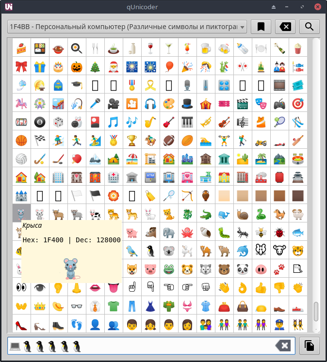

# qUnicoder

Advanced character map and typing tool with search (ru/en).
At first start downloads unicode data from [GitHub](https://github.com/unicode-table/unicode-table-data "github.com/unicode-table")

**Dependencies:**
- PyQt5
- requests

**Screenshots:**

